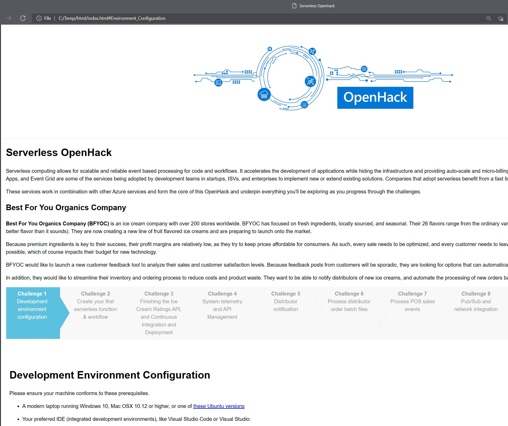

# Selfserve hacks compiler

This utility has been built with the purpose of generating an easy way to navigate the openhack challenges when its run as self serve.

## Prerequisites

Utility has been built as a .Net Core 5 console application thus requires the .net core 5 runtime at your environment.

## Running the utility

To run the utility you will have to build the Visual studio project `SelfServeCompiler`. You can do that either by opening the solution in Visual Studio building the solution and then runing the binaries produced or through command line with the `dotnet run` command.

The utility requires two arguments, the source path where the markdown files are located and the destination path where the html content will be generated. If the destination path does not exist it will be created by the utility. 

There's also an optional argument that you can provide and that is the image URI referenced inside the Markdown files. This will be replaced by the utility with a local path and images will be copied in that path.

```powershell
-s, --source         Required. Enter the source path of the MarkDown files
-d, --destination    Required. Enter the destination path for the web pages
-i, --ImagesUrl      (Default: https://serverlessoh.azureedge.net/public/) Use this argument to set the url of the images mentioned at the Markdown files. Url will be replaced with a local path at the destination html file
```

### Running through Command Line

Through your terminal navigate to the SelfServeCompiler folder of the repository and run:

>dotnet run -c Release SelfServeCompiler -s PATH_TO_THE_MARKDOWN_FILES -d OUTPUT_DIR

```powershell
# example:
dotnet run -c Release SelfServeCompiler -s C:\Projects\Openhacks\serverless\portal\en -d c:\Temp\html
```

Expected output

```console
Reading Content Definition File...
Transforming Overview content...
Building page Challenge 1: Development environment configuration...
Building page Challenge 2: Create your first serverless function & workflow...
Building page Challenge 3: Finishing the Ice Cream Ratings API, and Continuous Integration and Deployment...
Building page Challenge 4: System telemetry and API Management...
Building page Challenge 5: Distributor notification...
Building page Challenge 6: Process distributor order batch files...
Building page Challenge 7: Process POS sales events...
Building page Challenge 8: Pub/Sub and network integration...
Building page Challenge 9: Alerting and notification...
Building page Challenge 10: Putting it all together...
Constructing the html page
Copying Images...
Copying alerting-and-notification-progress-diagram.jpg...
Copying distributor-notification-progress-diagram.jpg...
Copying final-progress-diagram.jpg...
Copying order-batch-files-progress-diagram.jpg...
Copying process-pos-sales-event-progress-diagram.jpg...
Copying pubsub-and-vnet-integration-progress-diagram.jpg...
Copying pubsub-and-vnet-integration-virtual-network-diagram.png...
Copying ratings-api-progress-diagram.jpg...
Copying readme.md...
Copying system-telemetry-and-api-management-progress-diagram.jpg...
```

Once the program has completed you can navigate at the page `index.html` that's generated at the given path.


